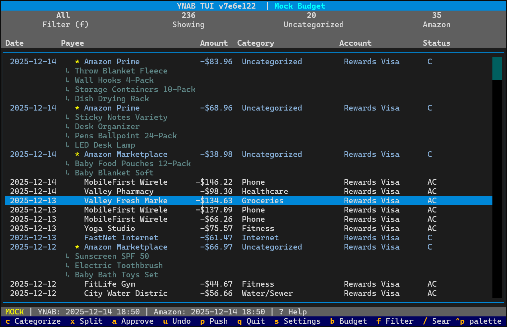

# YNAB TUI

[](https://github.com/esterhui/ynab-tui/actions/workflows/ci.yml)
[](https://codecov.io/gh/esterhui/ynab-tui)
[](https://www.python.org/downloads/)
[](LICENSE)
[](https://github.com/astral-sh/ruff)

A terminal user interface for categorizing YNAB (You Need A Budget) transactions with Amazon order matching.



## Features

- **TUI for transaction review** - Review and categorize uncategorized transactions
- **Amazon order matching** - Scrapes your Amazon order history to identify purchased items
- **Split transaction support** - Split Amazon orders into individual items with separate categories
- **Historical pattern learning** - Learns from your categorization decisions for recurring payees
- **Git-style workflow** - Pull transactions to local DB, categorize offline, push changes back
- **Multi-budget support** - Switch between YNAB budgets
- **Advanced filtering** - Filter transactions by category, payee, or status
- **Bulk tagging** - Tag multiple transactions for batch operations
- **Undo support** - Revert categorizations before pushing
- **CSV export** - Export transaction data for external analysis
- **Mock mode** - Test without real credentials using synthetic data

## Installation

```bash
# Clone and install
git clone https://github.com/esterhui/ynab-tui.git
cd ynab-tui
uv sync --all-extras
```

## Configuration

Copy the example config and fill in your credentials:

```bash
mkdir -p ~/.config/ynab-tui
cp config.example.toml ~/.config/ynab-tui/config.toml
```

Required credentials:
- **YNAB API token** - Get from https://app.ynab.com/settings/developer
- **Amazon credentials** - Your Amazon login (for order history scraping via [amazon-orders](https://github.com/alexdlaird/amazon-orders))

You can also use environment variables:
```bash
export YNAB_API_TOKEN="your-token"
export AMAZON_USERNAME="your-email"
export AMAZON_PASSWORD="your-password"
```

## Usage

### TUI (Terminal User Interface)

```bash
# Launch the TUI
uv run python -m src.main

# Or use mock mode (no credentials needed)
uv run python -m src.main --mock
```

**Vim-style keybindings:**
- `j/k` or arrows - Navigate up/down
- `g/G` - Go to top/bottom
- `Ctrl+d/u` - Page down/up
- `c` - Categorize selected transaction
- `a` - Approve transaction
- `x` - Split transaction (for Amazon orders)
- `u` - Undo last change
- `p` - Preview pending changes
- `/` - Search transactions
- `f` - Cycle filter (all/approved/uncategorized/pending)
- `t` - Tag transaction for bulk operations
- `T` - Clear all tags
- `b` - Switch budget
- `s` - Settings
- `?` - Help
- `q` - Quit

### CLI Commands

```bash
# Sync commands (git-style pull/push)
uv run python -m src.main pull              # Pull YNAB + Amazon data to local DB
uv run python -m src.main pull --full       # Full pull of all data
uv run python -m src.main push              # Push local categorizations to YNAB
uv run python -m src.main push --dry-run    # Preview what would be pushed

# List uncategorized transactions
uv run python -m src.main uncategorized

# Database inspection
uv run python -m src.main db-status         # Show sync status and statistics
uv run python -m src.main db-deltas         # Show pending changes before push
uv run python -m src.main ynab-budgets      # List available budgets

# Category mappings (learn from history)
uv run python -m src.main mappings          # Query learned item->category mappings
uv run python -m src.main mappings-create   # Build mappings from approved transactions

# Test connections
uv run python -m src.main ynab-test
uv run python -m src.main amazon-test
```

### Makefile

A Makefile is provided for common tasks. Run `make help` to see all available targets:

```
YNAB TUI

Make targets:
  make install    - Install dependencies
  make run        - Launch TUI application
  make test       - Run tests
  make coverage   - Run tests with coverage report
  make sloc       - Count lines of code (requires scc)
  make check      - Lint code
  make format     - Format code
  make mock-data  - Generate synthetic mock CSV data (deterministic)
  make mock-prod-data - Export production DB to mock CSV files
  make clean      - Remove cache files

Sync commands (git-style):
  make pull       - Pull YNAB + Amazon data to local DB (incremental)
  make pull-full  - Full pull of all data
  make push       - Push local categorizations to YNAB
  make push-dry   - Preview what would be pushed
  make db-status  - Show database sync status

CLI examples:
  uv run python -m src.main                     # Launch TUI
  uv run python -m src.main amazon-match        # Match Amazon transactions
  uv run python -m src.main uncategorized       # List uncategorized transactions
  uv run python -m src.main --help              # Show all commands

Mock mode (no live APIs):
  uv run python -m src.main --mock              # Launch TUI with mock data
  uv run python -m src.main --mock db-clear     # Only clears mock DB
```

## How It Works

1. **Pull** transactions from YNAB and orders from Amazon to local SQLite database
2. **Match** Amazon transactions to orders by amount and date (fuzzy matching)
3. **Review** uncategorized transactions in the TUI
4. **Categorize** using the category picker or split into individual items
5. **Push** your changes back to YNAB

### Typical Workflow

**First time setup:**
```bash
# Do a full pull to download all YNAB transactions and Amazon order history
uv run python -m src.main pull --full
```

**Ongoing usage:**
```bash
# 1. Pull new transactions (incremental - only fetches recent changes)
uv run python -m src.main pull

# 2. Launch the TUI to review and categorize
uv run python -m src.main

# 3. In the TUI: navigate with j/k, categorize with 'c', approve with 'a'
#    For Amazon orders, use 'x' to split into individual items

# 4. Push your changes back to YNAB (from CLI or use 'P' in TUI)
uv run python -m src.main push

# Optional: preview changes before pushing
uv run python -m src.main push --dry-run
```

### Amazon Order Matching

YNAB transactions from Amazon typically show as "Amazon.com" with just the total amount, making it difficult to know what you actually purchased. This tool uses [amazon-orders](https://github.com/alexdlaird/amazon-orders) to scrape your Amazon order history and match transactions to specific orders.

**How matching works:**
- Matches by amount (within $0.10 tolerance) and date (7-day window, extended to 24 days if needed)
- Once matched, the TUI shows the actual items purchased instead of just "Amazon.com"
- You can then categorize the whole order, or use split (`x`) to break it into individual items with separate categories

**Example:** A $45.67 Amazon transaction gets matched to an order containing:
- Book: "Clean Code" - $29.99 → Categorize as "Books"
- USB Cable - $15.68 → Categorize as "Electronics"

This makes Amazon transactions much easier to categorize accurately.

## Development

```bash
# Run tests
uv run pytest tests/ -v

# Lint and format
uv run ruff check src/ tests/
uv run ruff format src/ tests/

# Run with mock data (no credentials needed)
uv run python -m src.main --mock
```

## License

MIT
